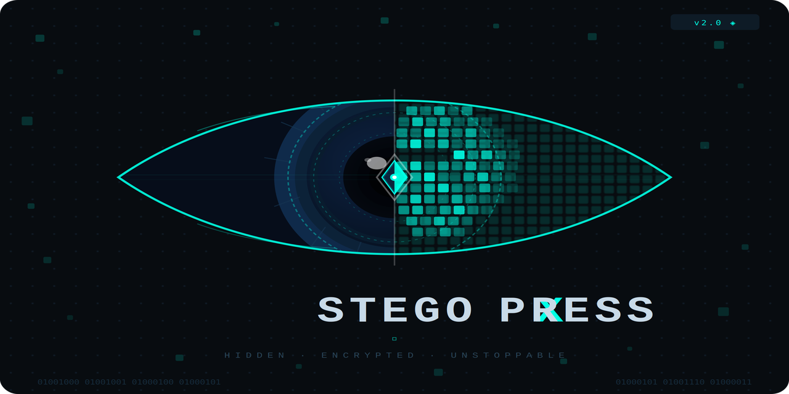

<p align="center">
  
</p>

<h1 align="center">StegoXpress</h1>

<p align="center"><b>Hide AES-256-GCM-encrypted secrets inside ordinary images, WAV audio, and PNG metadata.</b><br/>
Dual-password decoy vaults &middot; N-of-K secret sharing &middot; tamper-evident seals &middot; built-in steganalysis scoring.</p>

---

## Why StegoXpress

Most steganography tools just flip pixel bits. StegoXpress encrypts **first** (AES-256-GCM, salted PBKDF2 with 600,000 iterations) and hides **second**, so even if the hidden data is found, it is useless without the password. On top of that core, it adds features normally found only in research tools:

| Feature | What it does |
|---|---|
| 🖼 **Multi-carrier** | Image LSB, adaptive LSB (high-entropy regions), WAV audio, PNG metadata chunk |
| 🔐 **StegoVault** | Two passwords: one reveals a decoy message, the other reveals the real one |
| 🛡 **StegoShield** | Splits a secret across N images; any K of them reconstruct it (Shamir, GF(2^8)) |
| 📜 **Tamper seal** | HMAC-SHA256 seal (salted PBKDF2 key) proves the payload was not modified |
| 🔥 **Local burn-after-read** | Optionally erases the LSB plane of the working copy after first decode |
| 📊 **Steganalysis score** | Estimates how detectable your stego image is before you send it |
| 🌡 **Entropy heatmap** | Visualizes where data is hidden / where it is safest to hide |

## Install

```bash
git clone https://github.com/Nakum-hub/StegoXpress.git
cd StegoXpress
pip install -r requirements.txt
```

Python 3.10+ required. For development: `pip install -e ".[dev]"`

## Usage

### GUI

```bash
python main.py
```

A dark-themed desktop app opens with six tabs: **Encode**, **Decode**, **Send** (email the stego image), **Vault**, **Shield**, and **History**.

### CLI

```bash
# Hide a message (password is read from an environment variable, never shell history)
export STEGO_PASSWORD='my strong passphrase'
python main.py encode --image cover.png --text "meet at noon" --output secret.png

# Hide a file, sealed against tampering
python main.py encode --image cover.png --file plans.pdf --seal --output secret.png

# Reveal
python main.py decode --image secret.png
```

Exit codes: `0` success, `1` wrong password / corrupt data, `2` bad arguments, `3` I/O error — script-friendly.

## Honest security model (read this)

StegoXpress is built to be honest about what it can and cannot do. Full details in [SECURITY.md](SECURITY.md).

**It protects against:** casual observers; recovery of the secret without the password (AES-256-GCM); silent tampering (authenticated encryption + seals).

**It does NOT protect against:** statistical steganalysis of large payloads (adaptive mode reduces, never eliminates, detectability); a determined forensic analyst examining vault images (hidden-volume deniability is statistical, not absolute); copies you no longer control ("burn-after-read" only erases the local working copy); lossy re-encoding (JPEG/screenshots destroy payloads — use PNG); a compromised endpoint.

## Quality

- CI on Python 3.10–3.12: ruff, mypy, pytest with coverage, pip-audit
- End-to-end test suites covering crypto, Shamir, adaptive LSB determinism, seals, vault, shield, audio and PNG-chunk carriers, plus fuzzing of all untrusted parsers
- Versioned, authenticated on-disk format with backward-compatible v1 decryption

## Build a standalone executable

```bash
pip install pyinstaller
pyinstaller StegoXpress.spec
```

## License

Proprietary commercial software — Copyright (c) 2026 Nakum-hub. All rights reserved.

StegoXpress v2.0.0 and later are distributed under the [StegoXpress Proprietary Software License](LICENSE). Purchase of a license grants personal / internal business use; redistribution and resale are not permitted. For commercial, OEM, or source-code licensing, contact the author via [GitHub](https://github.com/Nakum-hub).

*(Versions released before 12 June 2026 remain available under the MIT License that applied to them at the time.)*

## Disclaimer

This tool is for lawful use: protecting your own data, research, and education. You are responsible for complying with the laws of your jurisdiction.
